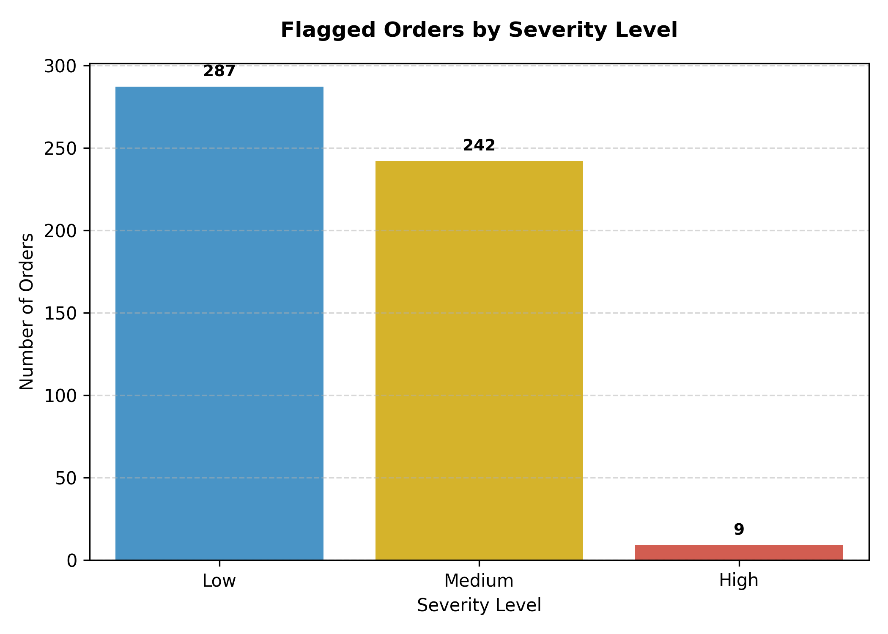
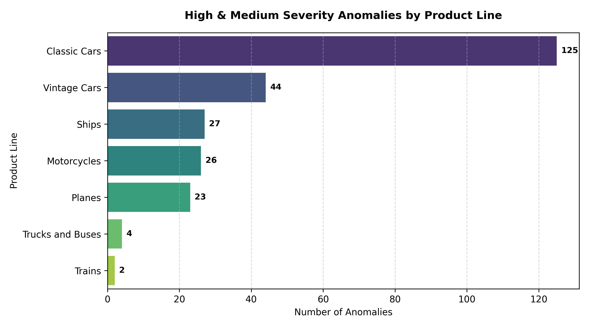

# 📦 Order Anomaly Detector
> Turning 2,823 raw orders into a 9-item priority action list — automatically.
An end-to-end anomaly detection pipeline that scans supply chain order data, flags pricing errors, cancellations, and statistical outliers, and ranks them by severity — so human reviewers spend time only where it actually matters.
---
## 🎯 The Problem
Manually reviewing thousands of order records for pricing errors, cancellations, and unusual transactions doesn't scale. Issues get missed. Analysts burn hours scanning rows that are perfectly fine.
**This pipeline automates the first pass** — so review time goes only to the highest-risk cases.
---
## ⚙️ How It Works
📥 Ingest & Clean → 🔍 Detect Anomalies → 🚦 Score Severity → 📊 Visualize

| Stage | What Happens |
|---|---|
| **1. Ingestion & Quality Check** | Load, clean, validate — missing values, duplicates, date ranges |
| **2. Anomaly Detection** | Rule-based checks (cancelled/disputed orders, sub-MSRP pricing, price-to-sales ratio outliers) + statistical outlier detection (IQR on price & quantity, per product line) |
| **3. Severity Scoring** | Each order scored by how many rules it triggers; confirmed problem statuses weighted higher than statistical flags. Bucketed into 🟢 Low / 🟡 Medium / 🔴 High |
| **4. Visualization** | Charts showing severity spread and risk concentration by product line |
---
## 📊 Results
| Metric | Value |
|---|---|
| Orders processed | **2,823** |
| Flagged as anomalous | **538** (19.06%) |
| 🔴 High priority (needs immediate review) | **9** |
| Highest-risk product line | **Classic Cars** (125 anomalies) |
> **99%+ reduction in manual review load** for the highest-priority segment — 9 orders to check instead of 2,823.
---
## 🖼️ Charts
**Severity Distribution**

**Risk Concentration by Product Line**

---
## 🛠️ Tools Used
`Python` · `pandas` · `numpy` · `matplotlib`
---
## 🚀 How to Run
```bash
pip install -r requirements.txt
python src/ingest_data.py
python src/detect_anomalies.py
python src/severity_scoring.py
python src/generate_visualizations.py
```
Input data → `data/` · Output (flagged CSVs + charts) → `output/`
---
## 📁 Project Structure
order-anomaly-detector/
├── data/ # raw input data
├── src/ # pipeline scripts (run in order)
├── outputs/ # flagged CSVs + charts
├── README.md
└── requirements.txt 
---
## 💡 Why This Matters
This isn't a generic script — it's a decision-support tool. It converts unstructured risk (thousands of unreviewed transactions) into a ranked, actionable list, mirroring how real supply chain and analytics teams triage operational issues at scale.
